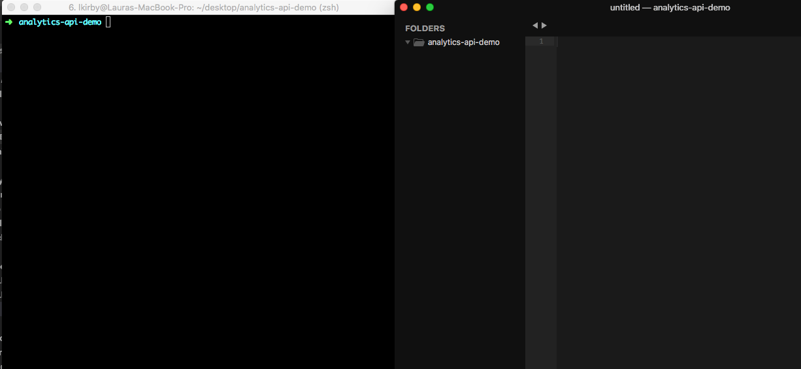

# Aspera IBM: Analytics API

* This example was created using a Linux machine

## Dependencies

* [Ruby](https://www.ruby-lang.org/en/documentation/installation/)
* Ruby gem manager (eg [rvm](https://rvm.io/))
* [Bundler](https://bundler.io/)

For spimlicity purposes, all files that will be required for this demo will be stored in `analytics-api-demo` directory. Go ahead and create that directory now. In terminal, complete the following:

   ```bash
    mkdir analytics-api-demo
    cd analytics-api-demo
   ```

   <div class="demo-image">
     
   </div>

The rest of this tutorial assumes that any time we are using terminal, we are in this newly created directory.

## Integration & Authorization Setup

* Follow [these setup intructions](./setup.md) to obtain the following pieces of required information:
  * Client ID
  * Client Secret
  * JWT private
  * JWT public
  * New AoC Integration

## Files Authorization & Analytics Requests

* [Analytics API](./analytics-api.md)