# Setup

1. Generate private and public keys

  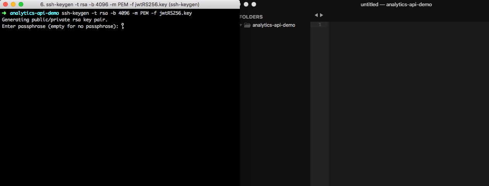

1. You should see the keys in the newly created files.

  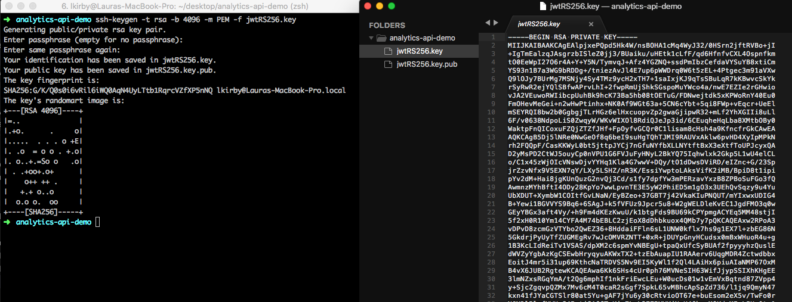

1. Configure the public key for openssl

  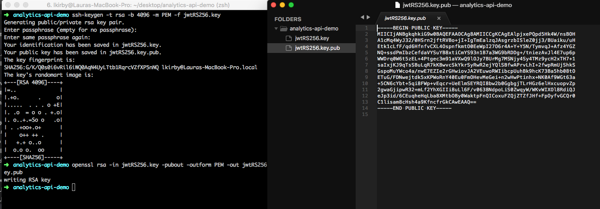

1. In the "Admin" app of AoC, create a new "Integration"

  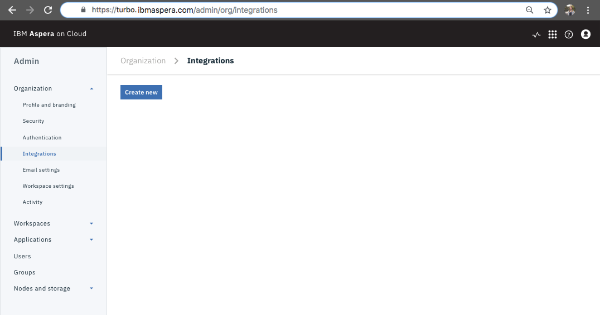

1. Here is what the "new" form will look like

  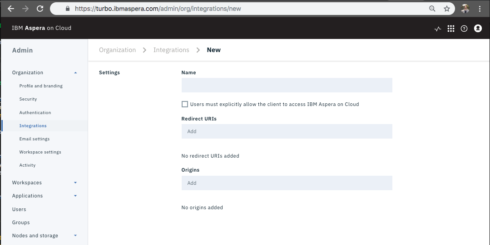

1. Fill out form, for the purpose of the Analytics API, the "Redirect URIs" and "Orgins" can be any random value. Click "Save".

  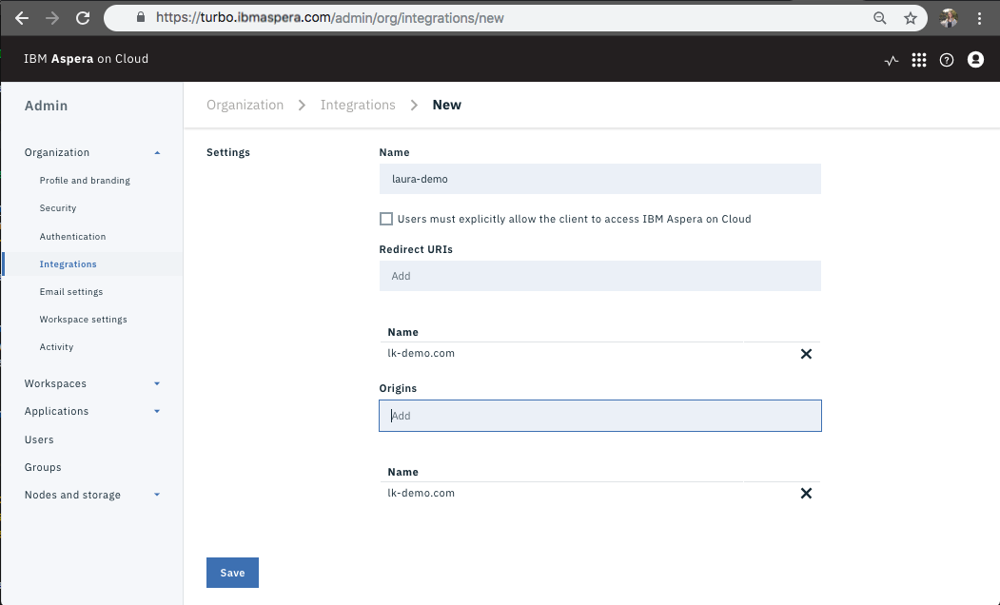

1. You should now be looking at your "Profile".

  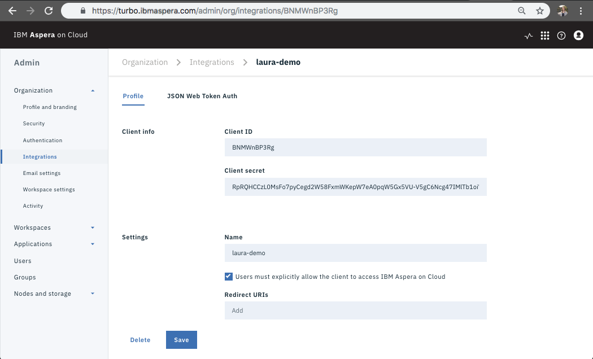

1. Click on the submenu "JSON Web Token Auth".

  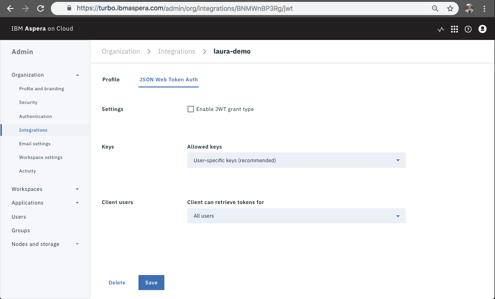

1. Make the following selections to permit authentication (double check this, may not need to grant as much access).

  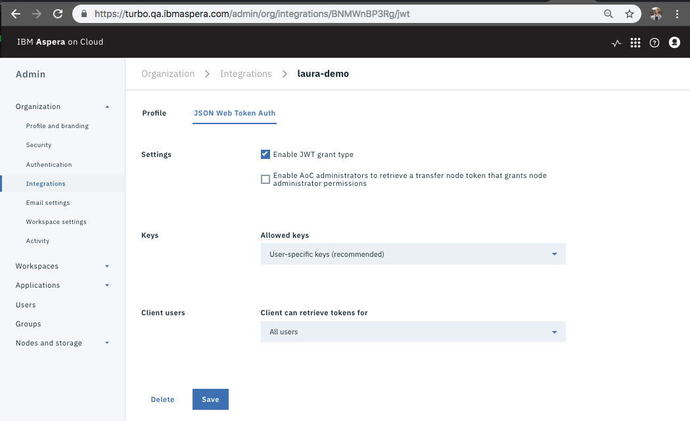

1. Make the additional following selections to permit authentication (double check this, may not need to grant as much access).

  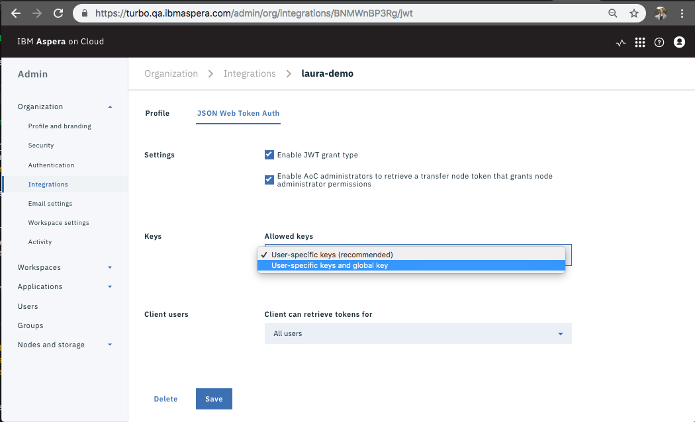

1. Confirm that you would like to permit global keys.

  

1. Add your public JWT (generated in step 3) to the field titled "Public Key (PEM Format)".

  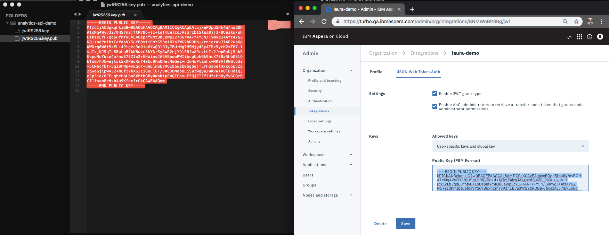

1. Back in terminal, create an empty `.config.yml` file.

  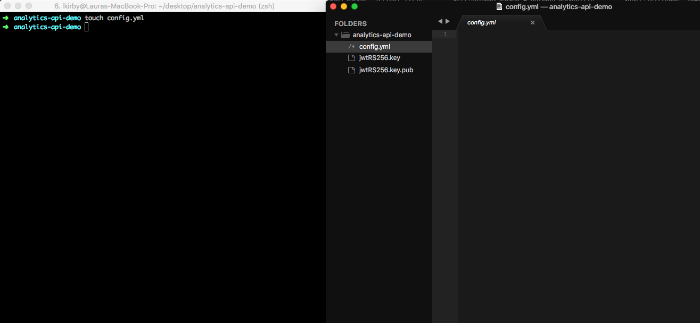

1. Use the submenu to vist your integration "Profile". Use the keys that I have listed in the `config.yml` file; however, update the values with information that is specific to you.

  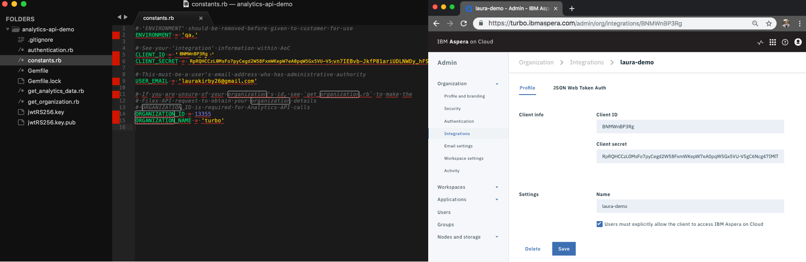

