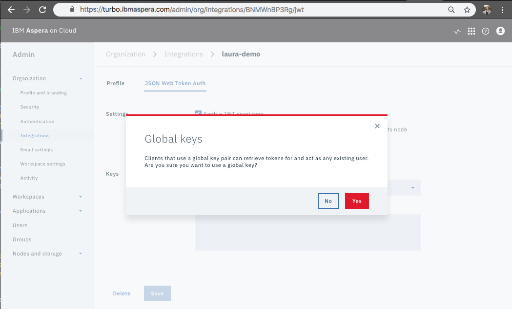

# System and Application Setup

This page take you through the necessary setup to prepare your local system and Aspera on Cloud (AoC) so that you can make API calls to the Activity app.

There are two main procedures: 

  > I. Obtain the necessary elements for authorization 
  
  > II. Prepare an integration with AoC 
 

## I. Obtain the necessary elements for authorization 

1. For the purpose of simplicity, create an `analytics-api-demo` directory to hold all the required files for this procedure. In terminal, run the following:

    ```bash
    mkdir analytics-api-demo
    cd analytics-api-demo
    ```

1. To generate private and public keys, run the following:

    ```bash
    ssh-keygen -t rsa -b 4096 -m PEM -f jwtRS256.key
    ```

    When prompted, press enter twice to create a key without a passphrase.

     <div class="demo-image">
       
     </div>

    You should see the keys in the newly created files.
    
    The image below displays the expected output and an example key.

    <div class="demo-image">
     
    </div>

1. Configure the public key for openssl

    ```bash
    openssl rsa -in jwtRS256.key -pubout -outform PEM -out jwtRS256.key.pub
    ```

     <div class="demo-image">
       
     </div>

## II. Prepare an integration with AoC 

1. In the "Admin" application of AoC, create a new "Integration"

    <div class="demo-image">
     
    </div>

1. Here is what the "new" form will look like

    <div class="demo-image">
     
    </div>

1. Fill out form, for the purpose of the Analytics API, the "Redirect URIs" and "Origins" can be any value. Click "Save".

    <div class="demo-image">
     
    </div>

1. You should now be looking at your newly created Integration's "Profile".

    <div class="demo-image">
     
    </div>

1. Click on the submenu "JSON Web Token Auth".

    <div class="demo-image">
     
    </div>

1. Select the check-box for "Enable JWT grant type".

    <div class="demo-image">
     
    </div>

1. From the drop-down menu, select, "User-specific keys and global key".

    <div class="demo-image">
     
    </div>

1. Confirm that you would like to permit global keys. Click "Yes".

    <div class="demo-image">
     
    </div>

1. Add your public JWT (generated in step 3) to the field titled "Public Key (PEM Format)". Click "Save".

    <div class="demo-image">
     
    </div>

1. In terminal, create an empty `.config.yml` file.

    ```bash
    touch config.yml
    ```

     <div class="demo-image">
       
     </div>

1. In the AoC application, use the submenu to visit your integration "Profile". Use the keys that I have listed in the `config.yml` file; however, update the values with information that is specific to you.

    <div class="demo-image">
     
    </div>

1. Visit [API Requests](./analytics-api.md) to learn about making requests to the Analytics API.
