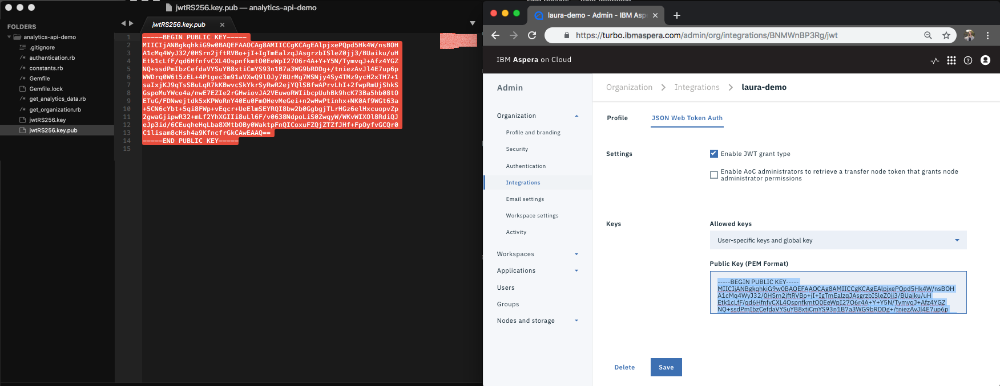

# Configuring Local System and Aspera on Cloud 

In this part, we will walk through the necessary setup to configure your local system and the Aspera on Cloud Platform (AoC) so that you can make API calls to the Activity application.

There are two main procedures:

  > I. Obtain the necessary elements for authorization

  > II. Configure an integration with AoC

## I. Obtain the necessary elements for authorization

1. In terminal, create a directory with a useful name, such as `analytics-api-demo`, to hold all the required files for this procedure:

    ```bash
    mkdir analytics-api-demo
    cd analytics-api-demo
    touch get_analytics_data.rb authentication.rb get_organization.rb constants.rb Gemfile
    ```

1. Generate private and public keys:

    *Note:* To maintain security, Aspera recommends that you do not use version control to track files that contain security information. This includes the private and public keys that you create in this step. Example keys shown in this tutorial are included for purposes of demonstration only and are no longer valid.

    ```bash
    ssh-keygen -t rsa -b 4096 -m PEM -f jwtRS256.key
    ```

    A prompt, `Enter passphrase (empty for no passphrase)` appears.

    To create a key without a passphrase, press Enter twice.

    If the process is successful, your new directory `analytics-api-demo` contains two key files, one private (`.key`) and one public (`.key.public`).

    The image below displays the expected terminal output and an example private key.

    <div class="demo-image">
     
    </div>

   Note that for all subsequent processes in terminal, you must navigate to the directory created above.

1. Configure the public key to work with OpenSSL:

    ```bash
    openssl rsa -in jwtRS256.key -pubout -outform PEM -out jwtRS256.key.pub
    ```

     <div class="demo-image">
       
     </div>

## II. Create an integration with AoC

1. Go to `*.ibmaspera.com`, where `*` represents your subdomain. Your subdomain will be unique to your organization in Aspera on Cloud. In this tutorial `turbo` is used as the subdomain.

<div class="demo-image">
     
    </div>

   Click the dropdown next to the **Organization** menu category and click **Integrations**. Click **Create New**.

   An new integration form opens.

<div class="demo-image">
     
    </div>

1. Fill out the form with appropriate values for your integration.

   * Enter a name for your integration.

   * Enter values for **Redirect URIs** and **Origins**. If you do not already have a designated value for each, enter a placeholder value, such as `www.company.com`. (These values are not needed for the Files API, but they are required fields in the current template.) After you enter each value, it appears under a **Name** header.

    <div class="demo-image">
     
    </div>

   When done, click **Save**.

   You now see a newly created **Profile** for your integration.

    <div class="demo-image">
     
    </div>

1. To update your integration to permit JWT authentication, do the following:
    * Click the submenu **JSON Web Token Auth** (next to **Profile**).
    * Select the check-box for **Enable JWT grant type**.
    * From the **Allowed keys** dropdown, select **User-specific keys and global key**.

    <div class="demo-image">
     
    </div>

    In the pop-up that appears, click **Yes** to confirm that you want to permit global keys.

    <div class="demo-image">
     
    </div>

    A field called **Public Key (PEM Format)** now appears. Copy the complete contents of `analytics-api-demo/*.key.public` (which you created in step 3).

    <div class="demo-image">
     
    </div>

   Click **Save**.

   Keep this page open.

1. Add the constants listed below (for example, `ORGANIZATION_SUBDOMAIN`) to the file `constants.rb`. Use values that are specific to your configuration (for example, `'my-company-name'`).


   ```CLIENT_ID = BNMWnBP3Rg
   CLIENT_SECRET = 'RpRQHCCzLOMsFo7pyCegd2W58FxmWKep'
   USER_EMAIL = 'laurakirby26@gmail.com'
   ORGANIZATION_ID = 13355
   ORGANIZATION_SUBDOMAIN = 'turbo'
   ```

   You will need to copy information from your integration's Profile page.

   <div class="demo-image">
       
      </div>

    **Where to find the values:**

    | Key | Value |
    | --- | --- |
    | `CLIENT_ID` | Found in the "Client info" section on the *Integrations > Profile* page |
    | `CLIENT_SECRET` | Found in the "Client info" section on the *Integrations > Profile* page |
    | `USER_EMAIL` | Your email address |
    | `ORGANIZATION_ID` | The ID for your organization in Aspera on Cloud. If you do not know your organization ID, see the Files API call within [get_organization.rb](https://github.com/LauraKirby/aspera-ibm-analytics-api/blob/master/analytics-api-demo/get_organization.rb) |
    | `ORGANIZATION_SUBDOMAIN` | The subdomain in your organization's URL |

Now that you have completed the setup process, visit [Install Dependencies](./dependencies.md) to learn about installing system dependencies for making making requests to the Analytics API.
